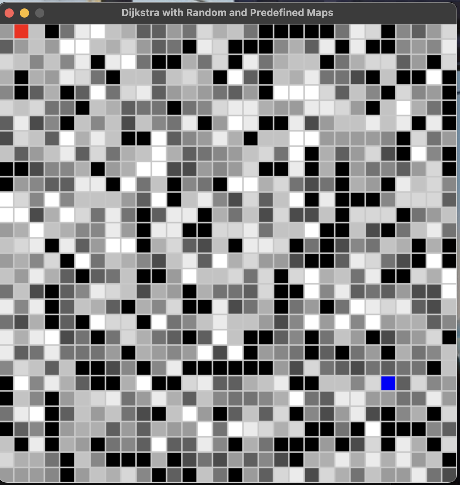
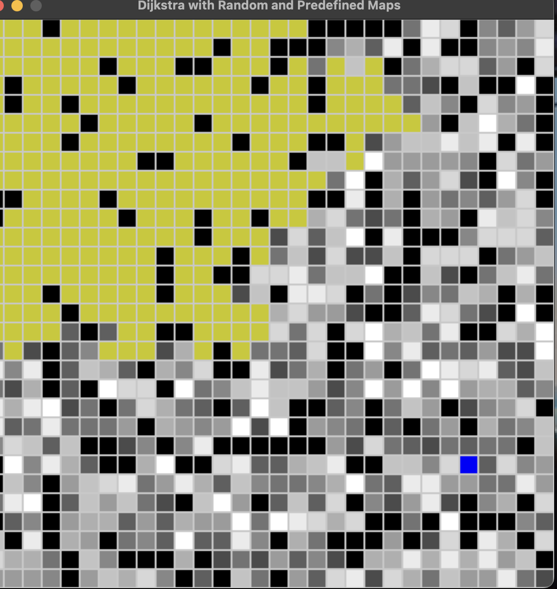
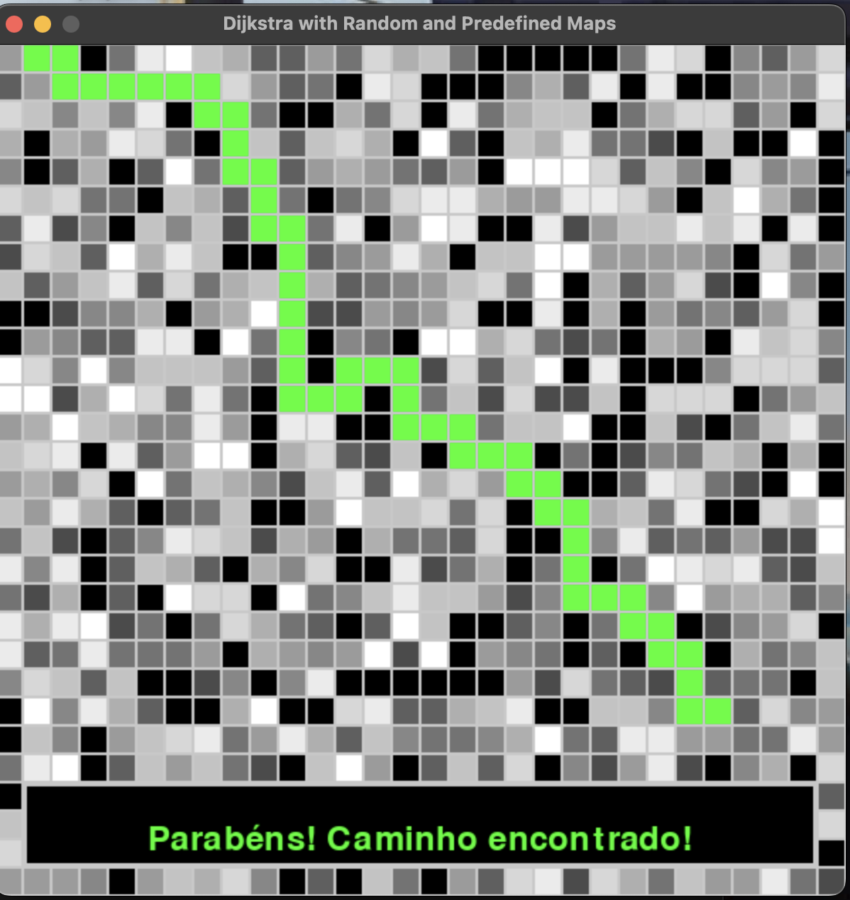

# Grafos2_MelhorCaminhoLabirinto

Tema:
 - Grafos2
**Número da Lista**:22

**Conteúdo da Disciplina**: Grafos 2 - Algoritmo de Dijikstra

## Alunos
|Matrícula | Aluno |
| -- | -- |
| 20/0038028  |  Guilherme Evangelista Ferreira dos Santos |
| 16/0147816  |  Vinícius Edwardo Pereira Oliveira |

## Sobre 
Foi criado um labirinto usando uma matriz 30x30 com pesos e obstáculos , onde usei o algoritmo de dijikstra para encontrar o melhor caminho possível. 

## Screenshots
Adicione 3 ou mais screenshots do projeto em funcionamento.

Mapa aleatório

Algoritmo de dikistra procurando melhor caminho 

Caminho encontrado

## Instalação 
**Linguagem**: python

**Framework**: pygame(biblioteca)

Requisitos:Ter o py instalado e a biblioteca pygame instalada nos módulos do seu python.

## Uso 
Após rodar o código o mapa aleatório será gerado , escolha seu caminho inicial clicando no quadrado desejado e o caminho final também.
Depois disso aperte a tecla espaço para rodar o algoritmo de dijikstra , após ele achar o caminho aperte a tecla enter para o boneco percorrer o caminho.
Se desejar um caminho pré definido aperte a tecla p para gera-lo ou aperte a tecla r para gerar um novo mapa aleatório.

## Vídeo
https://youtu.be/RkIuVJ8B9Kc

